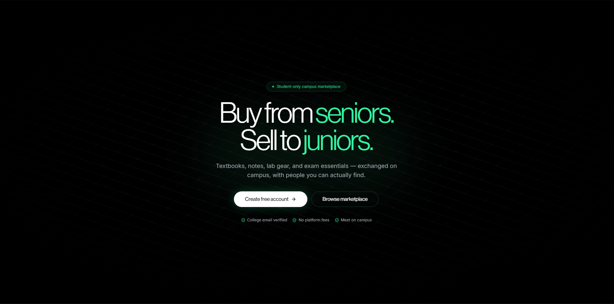

<div align="center">
  <br />
  
  <br /><br />

  

  <p><strong>Buy from seniors.&ensp;Sell to juniors.&ensp;Learn from peers.</strong></p>

  <p>
    A verified-student-only campus platform for textbooks, notes,<br />
    lab gear, exam essentials, and peer tutoring — exchanged on campus,<br />
    with people you can actually find.
  </p>

  <br />

  [**Features**](#-feature-tour) · [**Stack**](#-tech-stack) · [**Database**](#-database-schema) · [**Architecture**](#-architecture-notes) · [**Running locally**](#-running-locally) · [**Roadmap**](#-roadmap)

  <br />
</div>

---

## The problem

> College textbooks aren't a software-licensing problem — they're a **logistics** problem.

The book you need is sitting on a shelf in the hostel two blocks over, owned by someone who would gladly sell it for a third of the campus-store price. You just don't know who, and they don't know you exist. The senior who aced your exact course would tutor you for ₹200/hr — but there's no way to find them.

Existing solutions leak value at every step: WhatsApp groups disappear, random noticeboards go stale, seniors graduate without ever connecting to the juniors who need their stuff.

**PeerHelp is the directory + reputation + tutoring layer that makes the handoff obvious.**

| What we do | What we don't do |
|---|---|
| Connect students who want to trade | Hold your money |
| Verify college identity via OTP + document review | Act as a payment processor |
| Record reputation after trades | Allow anonymous listings |
| Surface hostel / dept metadata for quick meetups | Let outsiders browse or bid |
| Match verified peer tutors with learners | Charge a platform fee |
| Enable in-app messaging between parties | Store payment credentials |

---

## ✦ Feature tour

<details open>
<summary><strong>Marketplace — Books & Study Materials</strong></summary>

<br />

- **Books** with ISBN barcode scanner (webcam, via `@zxing/browser`) and Open Library auto-fill for cover art + title — listing a textbook takes 20 seconds.
- **Study materials** as a first-class listing type: `notes`, `past-year-questions` (PYQ), `pdf`, `rental` — with subject tagging and material-type filters.
- **Smart filters** that match how students shop: department, hostel, year of study, condition, price range, listing type, material type.
- **Image hosting** scoped per-user inside a Supabase Storage bucket. Server-side URL validation on every write — the client never gets to inject arbitrary image URLs. `openlibrary.org`, `books.google.com`, and `images.isbndb.com` are safelisted for ISBN-derived covers.
- **Public marketplace** at `/marketplace` — unauthenticated browse with pagination. Verified listing detail pages at `/marketplace/[id]`.
- **Rental listings** — books can be listed as rentals with flat or per-day pricing plus a security deposit. Duration and return dates are tracked on the deal.

</details>

<details>
<summary><strong>Deals & listing lifecycle</strong></summary>

<br />

```
ACTIVE ──▶ RESERVED ──▶ COMPLETED
   │            │
   └────────────┴──▶ CANCELLED
```

- **Deal flow:** buyer requests → seller accepts (listing becomes `reserved`) → meet on campus → mark complete → ratings unlock.
- **Rentals** with per-day or flat pricing, security deposit, proposed start date, and duration. `rental_start_date`, `rental_end_date`, and `return_confirmed_at` are recorded on both sides of the deal.
- **Partial lock** — once a deal is `accepted` or `completed`, the PATCH route enforces a field-level freeze:

  | Field | Locked? | Reason |
  |---|:---:|---|
  | `title`, `condition`, `price` | 🔒 | Buyer agreed to these |
  | `image_url`, `material_type`, `subject` | 🔒 | Identity fields |
  | `description`, `hostel`, `department`, `year` | ✏️ | Pickup info — seller can still coordinate |

  Violating the lock returns `HTTP 423` with a `lockedFields` payload. The UI disables locked inputs and shows an amber banner.

- **Bilateral ratings** after deal completion, surfaced on each seller's public profile card.
- **Buyer deal requests panel** in the dashboard — buyers track all their pending, accepted, and historical deals.
- **Seller deal requests panel** — sellers see incoming requests and can accept or decline each one.

</details>

<details>
<summary><strong>Peer Tutoring</strong></summary>

<br />

- **Tutor profiles** — any verified student can create a public tutor profile with a headline, bio, subjects (up to 8), teaching mode (`online` / `in_person` / `hybrid`), hourly rate, availability note, languages, and experience.
- **Public tutor directory** at `/tutors` — paginated, searchable by keyword, filterable by subject and mode. Accessible to anyone (no login required to browse).
- **Session requests** — verified students can send a session request to any active tutor, specifying subject, mode, proposed time, and a message. Tutors accept, decline, or mark complete.
- **Mutual exclusion** — a student cannot send a session request to themselves. Only one active profile is allowed per user.
- **Dashboard sections** for both sides: `/dashboard/tutoring` for tutor profile management and incoming requests, `/dashboard/tutoring/learning` for session requests you've sent.
- **Status lifecycle:** `pending → accepted → completed` or `pending → declined / cancelled`.
- **Tutor notifications** — session request received and request responded events are delivered in-app, by email, and as Web Push.

</details>

<details>
<summary><strong>In-app Messaging</strong></summary>

<br />

- **1-on-1 threads** scoped to an existing deal or tutor session request. Each deal/request gets exactly one thread (enforced by a unique index on `context_type + context_id`).
- **Realtime delivery** via Supabase Realtime postgres_changes — messages arrive instantly without polling. The sidebar thread list also updates live on `INSERT` to `messages` for the current user.
- **Read receipts** — `message_reads` tracks last-read timestamp per (thread, user). Unread badge counts are derived client-side.
- **Block list** — any user can block another. Blocked parties cannot send messages. Block/unblock managed via `/api/users/[id]/block` and listed in profile settings (`BlockedUsersList`).
- **Reporting** — users can report a thread or individual message. Reports land in `message_reports` and are reviewed in the admin panel.
- **SECURITY DEFINER RPCs** — direct INSERT/UPDATE on `message_threads` and `messages` is not permitted via RLS. All writes go through Postgres RPCs that enforce participation, block-list, and length checks.
- **Dashboard** at `/dashboard/messages` — responsive split-panel UI with thread sidebar and message view.

</details>

<details>
<summary><strong>Identity & trust</strong></summary>

<br />

- **Two verification paths:**
  1. **Email OTP** — student enters their college email; a 6-digit OTP is sent via Resend. Verifies in seconds.
  2. **Manual document review** — student uploads an ID document (ID card, fee receipt, etc.) for admin review. Stored in a private `verification-documents` Supabase Storage bucket.
- **Admin verification queue** at `/admin/verifications` — admins can approve, reject, or request changes on any pending submission. All decisions are logged in `verification_audit_log`.
- **Verification status** on `profiles`: `pending` → `verified` (or `rejected`). All listing and deal actions require `verified` status.
- **Re-verification** flow for stale records, with a `ReverifyButton` component in profile settings.
- **Durable rate limiting** — throttle state lives in the `rate_limit_attempts` Postgres table, not in memory. A serverless cold start cannot reset your counter. OTP, upload, and admin actions each have separate rate-limit types.
- **Row-Level Security everywhere** — direct database access respects `auth.uid()`-scoped policies. Storage bucket policies enforce `{auth.uid()}/*` paths.

</details>

<details>
<summary><strong>Notifications</strong></summary>

<br />

- **In-app notifications** via a `notifications` Postgres table + Server-Sent Events stream at `/api/notifications/stream`.
- The nav bell (`NotificationBell`) updates live without client-side polling. Notifications are marked read on open.
- **Email notifications** via Resend — each notification type maps to a transactional email template. Users can opt out per-type via `notification_preferences`.
- **Web Push** — VAPID-based push notifications delivered to installed PWA instances. Subscriptions stored in `push_subscriptions` with per-device endpoints. Opt-in toggle in profile settings (`PushSubscribeButton`). Push fires alongside every in-app notification event.
- **Notification types:** `deal_requested`, `deal_accepted`, `deal_declined`, `deal_cancelled`, `deal_completed`, `rating_received`, `verification_approved`, `verification_rejected`, `verification_changes_requested`, `tutor_request_received`, `tutor_request_responded`, `message_received`.

</details>

<details>
<summary><strong>Admin Panel</strong></summary>

<br />

- **Role-based access** — `admin_users` table with `reviewer` and `super` roles. `is_admin()` / `is_super_admin()` Postgres helper functions gate all admin RLS policies and route handlers.
- **Verification dashboard** at `/admin/verifications` — review queue with full document viewer, approve/reject/request-changes actions, and audit log.
- **Message reports queue** at `/admin/reports` — admins can view reported threads with full message context, and mark reports as reviewed or dismissed.
- **Stats overview** at `/admin` — live counts of pending/approved/rejected verifications.
- **Cron job** — `/api/admin/cron/purge-documents` runs hourly (Vercel Cron) to delete stale verification documents per retention policy. Protected by a `CRON_SECRET` bearer token.

</details>

<details>
<summary><strong>PWA</strong></summary>

<br />

- **Installable** — `manifest.webmanifest` with brand icons generated at runtime via `next/og`. `display: standalone`, `theme_color: #36F4A4`.
- **Offline shell** — hand-rolled service worker (`public/sw.js`). Static assets and `/_next/static/*` are cache-first. Navigations fall back to `/offline` when the network is unavailable. `/api/*` and `/auth/*` are always network-only to prevent cross-user auth leaks.
- **Install banner** — custom `beforeinstallprompt` UI with iOS share-sheet fallback. Dismissal suppressed for 30 days via `localStorage`.
- **Silent updates** — new service worker activates and auto-reloads in the background.
- **Push on click** — push notification click opens the relevant deep link (`/dashboard/deals`, `/dashboard/messages`, `/student-verification`, etc.).

</details>

---

## ⚡ Tech stack

| Layer | Choice | Notes |
|---|---|---|
| **Framework** | Next.js (App Router + Turbopack) | `cacheComponents: true`; partial prerendering on dashboard routes |
| **Runtime** | React 19 | Server Components by default; `"use client"` only on forms & interactive widgets |
| **Language** | TypeScript 5 strict | DB types generated via `supabase gen types` and committed |
| **Database** | Supabase (Postgres + RLS) | 28 migrations; also handles auth, realtime, and storage |
| **Auth** | Supabase Auth + custom OTP | Standard email/password gated behind college-email OTP |
| **Realtime** | Supabase Realtime (postgres_changes) | Messages; SSE for notification bell |
| **UI system** | shadcn/ui + Radix + Tailwind 3.4 | Design tokens; Neue Haas Display + Inter fonts |
| **Animation** | motion (Framer Motion v12) | Hero entrance animations, no CLS |
| **Email** | Resend | OTP delivery + notification transactional emails |
| **Barcode** | @zxing/browser | In-browser webcam ISBN scanning |
| **PWA** | Hand-rolled service worker + Web Push | No plugin; VAPID push via `web-push`; offline shell with network-only auth bypass |
| **Date handling** | date-fns v4 | Rental date calculations |
| **Calendar** | react-day-picker v9 | Rental date picker UI |
| **Deploy** | Vercel | Single project; Vercel Cron for document purge |

Single Vercel deploy + single Supabase project. No Redis, no queue, no background workers.

---

## 🗂 Repository layout

```
peerhelp/
│
├── app/
│   ├── (protected)/              ← Authenticated shell
│   │   ├── (admin)/              ← Admin panel (verifications, reports)
│   │   ├── (dashboard)/          ← Listings, deals, messages, tutoring, profile
│   │   └── (verification)/       ← College-email OTP gate
│   ├── api/                      ← Route handlers
│   │   ├── listings/             ← create · [id] PATCH (partial lock)
│   │   ├── deals/                ← request · accept · complete · cancel
│   │   ├── ratings/              ← post-deal bilateral ratings
│   │   ├── notifications/        ← list + SSE stream
│   │   ├── messages/             ← threads · [threadId] · context · report
│   │   ├── tutors/               ← create · requests · [id]
│   │   ├── users/                ← block · unblock · blocked list
│   │   ├── admin/                ← verifications · reports · cron
│   │   └── …
│   ├── auth/                     ← Supabase Auth pages
│   ├── marketplace/              ← Public unauthenticated browse
│   └── tutors/                   ← Public tutor directory
│
├── components/
│   ├── admin/                    ← ReportsTable, StatusPill
│   ├── auth/                     ← Login, sign-up, forgot-password forms
│   ├── deals/                    ← DealCard, DealActions, RatingForm, ContactReveal
│   ├── landing/                  ← Hero, HowItWorks, MarketplacePreview, CTA, Footer
│   ├── listing/                  ← Create + Edit forms, filters, image panel,
│   │                                ISBN scanner, status actions, deal CTAs, rental modal
│   ├── messages/                 ← MessagesShell, MessageThread, MessageThreadList,
│   │                                MessageButton, ReportDialog, ContextPreviewDialog
│   ├── nav/                      ← PublicNav, AppNav, AdminNav, NotificationBell
│   ├── profile/                  ← ProfileForm, ReverifyButton, BlockedUsersList,
│   │                                NotificationPrefsForm, PhoneForm
│   ├── pwa/                      ← ServiceWorkerRegister, InstallPrompt, PushSubscribeButton
│   ├── tutor/                    ← TutorCard, TutorForm, TutorsFilters, TutorsSearchBar,
│   │                                RequestSessionButton, SessionRequestStatusActions
│   ├── verification/             ← IdDocumentUpload, PendingReviewView
│   └── ui/                       ← shadcn primitives
│
├── lib/
│   ├── listing-image.ts          ← Server-side image URL validator
│   ├── college-directory.ts      ← Static college-name lookups
│   ├── email/                    ← Resend integrations (OTP + notification emails)
│   ├── notifications/notify.ts   ← Unified notifyUser() — in-app + email + push
│   ├── rate-limit/               ← Durable Postgres-backed throttle
│   ├── push/                     ← client.ts (browser subscribe) · server.ts (VAPID send)
│   └── supabase/                 ← client · server · admin · proxy helpers
│
├── utils/query/                  ← Typed query helpers by domain
│   ├── listings.ts, deals.ts, ratings.ts
│   ├── tutors.ts, messages.ts, blocks.ts
│   ├── notifications.ts, verification.ts
│   ├── profiles.ts, universities.ts, admin.ts
│   └── auth.ts
│
├── public/sw.js                  ← Service worker (cache-first static, network-first nav)
├── supabase/migrations/          ← Schema source of truth (001 → 028)
├── data/database.csv             ← College directory seed data
└── scripts/import-college-directory.mjs  ← CSV seeder
```

---

## 🗃 Database schema

28 migrations tracking the full schema evolution. Key tables:

| Table | Purpose |
|---|---|
| `profiles` | One row per user — name, college, verification status, phone |
| `college_verifications` | OTP and manual-review verification attempts with audit trail |
| `admin_users` | Admin allowlist with `reviewer` / `super` roles |
| `verification_audit_log` | Immutable log of every admin verification decision |
| `listings` | Book and material listings — sale and rental types |
| `deals` | Buyer–seller deal lifecycle with rental date tracking |
| `ratings` | Post-deal bilateral star ratings |
| `notifications` | In-app notification inbox per user |
| `notification_preferences` | Per-type email opt-out flags |
| `push_subscriptions` | VAPID Web Push subscription endpoints per device |
| `rate_limit_attempts` | Durable throttle state (OTP, upload, admin) |
| `colleges` | Seeded college directory for institution lookup |
| `tutor_profiles` | Peer tutor listings with subjects, mode, rate, and status |
| `tutor_session_requests` | Session request lifecycle between learner and tutor |
| `message_threads` | 1-on-1 thread scoped to a deal or tutor request |
| `messages` | Individual messages with denormalized `recipient_id` for Realtime filtering |
| `message_reads` | Per-(thread, user) last-read timestamp |
| `blocked_users` | Block relationships between users |
| `message_reports` | User-submitted abuse reports on threads/messages |

---

## 🏗 Architecture notes

**Server Components by default.** Data fetching happens in the Server Component that renders it. Only forms and widgets that need `onClick`/`useState` are `"use client"`. This keeps the JS bundle small and avoids waterfall fetches.

**Query helpers, not an ORM.** `utils/query/*.ts` wrap typed Supabase calls. Easy to read, RLS-friendly, zero abstraction tax. Each helper returns `{ data, error }` so call sites stay explicit.

**One source of truth for image URLs.** `lib/listing-image.ts` validates every image URL on write — rejects non-HTTPS, non-Supabase hosts (except the `openlibrary.org`, `books.google.com`, `images.isbndb.com` safelist), and paths that don't start with `/storage/v1/object/public/images/{userId}/`. The client *never* writes an arbitrary URL into the database.

**Partial lock contract.** `hasBlockingDeal()` runs a COUNT query on deals with status `accepted` or `completed`. When true (or listing status is `sold`/`reserved`), the PATCH route rejects any locked-field change with `HTTP 423 Locked` + `{ code: "listing_locked", lockedFields: [...] }`. The form strips those fields client-side and disables their inputs.

**Durable rate limiting.** The `rate_limit_attempts` Postgres table stores throttle events. Serverless cold starts can't bypass limits because state is never in-process memory.

**Messaging via Realtime, not SSE.** The notification bell uses SSE (simpler, stateless). Messages use Supabase Realtime postgres_changes — per-thread fan-out with typing indicators and read receipts justify a true Realtime channel. All message writes go through SECURITY DEFINER RPCs that enforce block-list and participation checks; direct INSERT/UPDATE on `messages` and `message_threads` is not permitted via RLS.

**Unified notifyUser().** `lib/notifications/notify.ts` is the single call site for all notification delivery: it inserts the in-app row via a SECURITY DEFINER RPC, checks email preferences before sending via Resend, then fire-and-forgets a Web Push (non-blocking — push errors don't fail the primary action).

**No payments — by design.** Money flows between two students in person (cash or UPI). PeerHelp is purely a discovery and reputation layer, not a fintech product. This keeps the legal surface area near zero.

---

## 🚀 Running locally

> **Prerequisites:** Node 20+, a Supabase project, a Resend API key.

```bash
# 1. Clone and install
git clone <repo>
npm install            # pnpm / bun also work

# 2. Environment
cp .env.example .env.local
```

```ini
# .env.local

# Supabase
NEXT_PUBLIC_SUPABASE_URL=https://<ref>.supabase.co
NEXT_PUBLIC_SUPABASE_PUBLISHABLE_KEY=<anon_key>
SUPABASE_SERVICE_ROLE_KEY=<service_role_key>

# Email (Resend)
RESEND_API_KEY=re_...
RESEND_FROM_EMAIL=noreply@yourdomain.com
RESEND_FROM_NAME=PeerHelp

# App
NEXT_PUBLIC_APP_URL=http://localhost:3000

# Cron secret (required by /api/admin/cron/purge-documents)
CRON_SECRET=some-random-secret

# Web Push — generate with: npx web-push generate-vapid-keys
VAPID_PUBLIC_KEY=<public_key>
VAPID_PRIVATE_KEY=<private_key>
VAPID_SUBJECT=mailto:you@yourdomain.com
NEXT_PUBLIC_VAPID_PUBLIC_KEY=<same as VAPID_PUBLIC_KEY>
```

```bash
# 3. Push schema to your Supabase project
supabase link --project-ref <ref>
supabase db push

# 4. (Optional) seed the college directory
npm run import:colleges

# 5. Pull DB types into the repo
npm run types:gen

# 6. Start dev server
npm run dev
```

> ⚠️ Do **not** add `export const dynamic` or `export const runtime` to any API route. The project uses `cacheComponents: true` in `next.config.ts` — caching policy is set at the page level by Next.js.

### Scripts

| Command | What it does |
|---|---|
| `npm run dev` | Start Turbopack dev server |
| `npm run build` | Production build |
| `npm run lint` | Run ESLint |
| `npm run types:gen` | Regenerate `lib/supabase/database.types.ts` from your linked project |
| `npm run import:colleges` | Seed `colleges` table from `data/database.csv` |

### Admin setup

After running `supabase db push`, manually insert yourself into `admin_users`:

```sql
insert into public.admin_users (user_id, email, role)
values ('<your-auth-uid>', 'you@college.edu', 'super');
```

Alternatively, use the seed file:

```bash
psql <connection-string> -f supabase/seed-admins.sql
```

---

## 🗺 Roadmap

- [x] Marketplace — books, study materials, sale & rental listings
- [x] Deal flow — request, accept, complete, cancel, bilateral ratings
- [x] College-email OTP verification
- [x] Manual document verification with admin review queue
- [x] In-app notifications (SSE) + email notifications + Web Push
- [x] Mobile PWA — install prompt, offline shell, web push
- [x] Peer tutoring — profiles, session requests, public directory
- [x] In-app messaging — realtime threads, read receipts, block list, reports
- [x] Admin panel — verification queue, message reports, cron document purge
- [ ] Reputation decay so dormant profiles ease back to neutral
- [ ] Bulk listing tools for graduating seniors

---